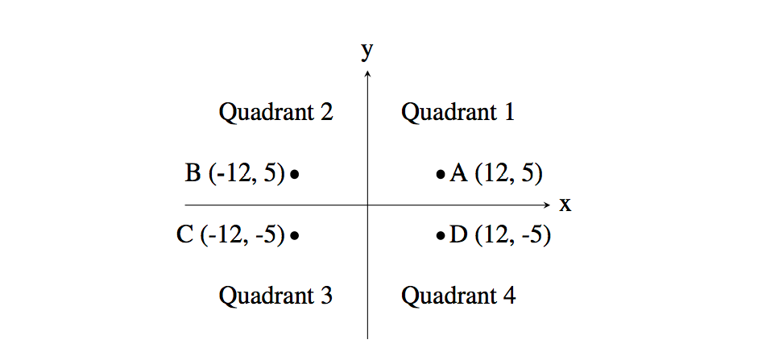

# 단계별_if문

---

----


# 1330. 두 수 비교하기

#### 두 정수 A와 B가 주어졌을 때, A와 B를 비교하는 프로그램을 작성하시오.

첫째 줄에 A와 B가 주어진다. A와 B는 공백 한 칸으로 구분되어져 있다.

첫째 줄에 다음 세 가지 중 하나를 출력한다.

- A가 B보다 큰 경우에는 '`>`'를 출력한다.
- A가 B보다 작은 경우에는 '`<`'를 출력한다.
- A와 B가 같은 경우에는 '`==`'를 출력한다.

``` python
1 2  #<

10 2 #>

5 5  #==
```

``` python
a, b = map(int, input().split())
if a > b:
    print(">")

elif a < b:
    print("<")

else:
    print("==")
```

쭉쭉 정답률이 올라가는것이 감격스럽다.. 

``` python
a, b = map(int, input()).split()
```

계속 이렇게 말도안되는 바보짓을 하고 있었는데, a와 b에 각각 값을 넣어줘야한다는 생각에만 말려 map이 split메소드를 지원하는지를 생각하지 않은 것이다. 

AttributeError: 'map' object has no attribute 'split'

그러나 우리의 친구 Error메세지가 힌트를 줬고, input값을 바로 split으로 변환해 그 값 각각을 int로 변환한 값을 a , b 에 할당해 줬다. 

----


# 9498. 시험 성적

#### 시험 점수를 입력받아 90 ~ 100점은 A, 80 ~ 89점은 B, 70 ~ 79점은 C, 60 ~ 69점은 D, 나머지 점수는 F를 출력하는 프로그램을 작성하시오.

| 시간 제한 | 메모리 제한 | 제출   | 정답   | 맞힌 사람 | 정답 비율 |
| :-------- | :---------- | :----- | :----- | :-------- | :-------- |
| 1 초      | 128 MB      | 204746 | 112993 | 97827     | 56.005%   |

## 

#### 시험 점수를 입력받아 90 ~ 100점은 A, 80 ~ 89점은 B, 70 ~ 79점은 C, 60 ~ 69점은 D, 나머지 점수는 F를 출력하는 프로그램을 작성하시오.

첫째 줄에 시험 점수가 주어진다. 시험 점수는 0보다 크거나 같고, 100보다 작거나 같은 정수이다.

시험 성적을 출력한다.

``` python
100
#A
```

``` python
score = int(input())

if score >=90:
    print("A")

elif score >=80:
    print("B")

elif score >=70:
    print("C")

elif score >=60:
    print("D")

else:
    print("F")
```

복습을 철저히 해서 if문을 단축시키는 방법이 기억이 났다. 

이상 이하 값을 일일히 적어주는 것도 물론 맞지만, 높은 조건 부터 적어내려가면 if문의 길이를 단축시킬 수 있다는 점을 기억하고 있었다. 조금이지만 발전한것 같아 뿌듯하다. 그런데도 한번만에 문제를 맞히지는 못했는데, >=을 >로 쓴 까닭이다. 스터디 준비를 위해 문제를 급하게 풀다보니 실수하는 것이라고는 생각하지만,, 그래도 더 꼼꼼하게 문제를 읽는 습관을 가져야겠다. 

----


# 2753. 윤년

#### 연도가 주어졌을 때, 윤년이면 1, 아니면 0을 출력하는 프로그램을 작성하시오.

#### 윤년은 연도가 4의 배수이면서, 100의 배수가 아닐 때 또는 400의 배수일 때이다.

#### 예를 들어, 2012년은 4의 배수이면서 100의 배수가 아니라서 윤년이다. 1900년은 100의 배수이고 400의 배수는 아니기 때문에 윤년이 아니다. 하지만, 2000년은 400의 배수이기 때문에 윤년이다.

첫째 줄에 연도가 주어진다. 연도는 1보다 크거나 같고, 4000보다 작거나 같은 자연수이다.

첫째 줄에 윤년이면 1, 아니면 0을 출력한다.

``` python
2000 
#1

1999
#0
```

``` python
year = int(input())

if (year % 4 == 0 and year % 100 != 0) or year % 400 == 0:
    print(int(True))

else:
    print(int(False))
```

그냥 print(1)을 하지않았던건 내가 지금 int(True)반이기 때문에ㅎㅎ 그리고 print(True)를 하면 True가 반환되는지 1이 반환되는지 헷갈려 다시 확인하고 싶었기 때문도 있다. 

-----


#  14681. 사분면 고르기 

#### 흔한 수학 문제 중 하나는 주어진 점이 어느 사분면에 속하는지 알아내는 것이다. 사분면은 아래 그림처럼 1부터 4까지 번호를 갖는다. "Quadrant n"은 "제n사분면"이라는 뜻이다.



#### 예를 들어, 좌표가 (12, 5)인 점 A는 x좌표와 y좌표가 모두 양수이므로 제1사분면에 속한다. 점 B는 x좌표가 음수이고 y좌표가 양수이므로 제2사분면에 속한다.

#### 점의 좌표를 입력받아 그 점이 어느 사분면에 속하는지 알아내는 프로그램을 작성하시오. 단, x좌표와 y좌표는 모두 양수나 음수라고 가정한다.

첫 줄에는 정수 x가 주어진다. (−1000 ≤ x ≤ 1000; x ≠ 0) 다음 줄에는 정수 y가 주어진다. (−1000 ≤ y ≤ 1000; y ≠ 0)

점 (x, y)의 사분면 번호(1, 2, 3, 4 중 하나)를 출력한다.

``` python
12
5

#1
```

``` python
x = int(input())
y = int(input())

if x > 0 and y > 0:
    print(1)

elif x > 0 and y < 0:
    print(4)

elif x < 0 and y > 0:
    print(2)

else:
    print(3)
```

또 한번만에 맞았다! 문제가 조금 복잡하게 생겨서 처음에는 겁을 먹었지만 이내 그럴 필요가 없다는 걸 깨달았다 

``` python
x = int(input())
y = int(input())

if x > 0 and y > 0:
    a = 1

elif x > 0 and y < 0:
    a = 4

elif x < 0 and y > 0:
    a = 2

else:
    a = 3

print(a)
#print(f'{a}사분면에 속합니다')
```

반복되는 print문의 사용을 줄이기 위해 새로운 시도를 해보았다. 조금 더 직관적으로 보이게 하기 위해 f스트링을 사용하였다. 

---


# 2884. 알람시계

#### 상근이는 매일 아침 알람을 듣고 일어난다. 알람을 듣고 바로 일어나면 다행이겠지만, 항상 조금만 더 자려는 마음 때문에 매일 학교를 지각하고 있다.

#### 상근이는 모든 방법을 동원해보았지만, 조금만 더 자려는 마음은 그 어떤 것도 없앨 수가 없었다.

#### 이런 상근이를 불쌍하게 보던, 창영이는 자신이 사용하는 방법을 추천해 주었다.

#### 바로 "45분 일찍 알람 설정하기"이다.

#### 이 방법은 단순하다. 원래 설정되어 있는 알람을 45분 앞서는 시간으로 바꾸는 것이다. 어차피 알람 소리를 들으면, 알람을 끄고 조금 더 잘 것이기 때문이다. 이 방법을 사용하면, 매일 아침 더 잤다는 기분을 느낄 수 있고, 학교도 지각하지 않게 된다.

#### 현재 상근이가 설정한 알람 시각이 주어졌을 때, 창영이의 방법을 사용한다면, 이를 언제로 고쳐야 하는지 구하는 프로그램을 작성하시오.

첫째 줄에 두 정수 H와 M이 주어진다. (0 ≤ H ≤ 23, 0 ≤ M ≤ 59) 그리고 이것은 현재 상근이가 설정한 놓은 알람 시간 H시 M분을 의미한다.

입력 시간은 24시간 표현을 사용한다. 24시간 표현에서 하루의 시작은 0:0(자정)이고, 끝은 23:59(다음날 자정 1분 전)이다. 시간을 나타낼 때, 불필요한 0은 사용하지 않는다.


첫째 줄에 상근이가 창영이의 방법을 사용할 때, 설정해야 하는 알람 시간을 출력한다. (입력과 같은 형태로 출력하면 된다.)


``` python
10 10
#9 25

0 30
#23 45

23 40
#22 55
```

``` python
a, b = map(int, input().split())
time = 60 * a + b - 45
new_hour = time // 60 
if new_hour < 0:
    new_hour = 24 + new_hour
    
new_minute = time % 60 
print(new_hour, new_minute)
```

한번에 맞았다! 이번에는 map함수를 쓰는 법이 헷갈리지도 않았다. 그런데 new hour를 새로 지정하는 방법이 다른것이 있을 것 같기 때문에 스터디원들과 상의를 해보려한다. 