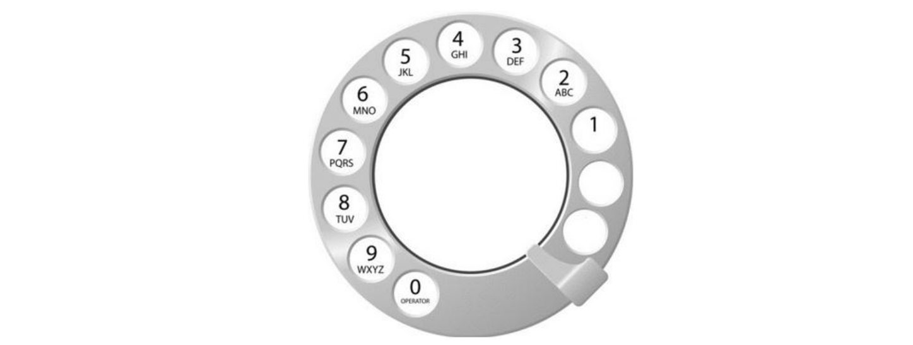

# 10809. 알파벳 찾기

#### 알파벳 소문자로만 이루어진 단어 S가 주어진다. 각각의 알파벳에 대해서, 단어에 포함되어 있는 경우에는 처음 등장하는 위치를, 포함되어 있지 않은 경우에는 -1을 출력하는 프로그램을 작성하시오.

#### 첫째 줄에 단어 S가 주어진다. 단어의 길이는 100을 넘지 않으며, 알파벳 소문자로만 이루어져 있다.

각각의 알파벳에 대해서, a가 처음 등장하는 위치, b가 처음 등장하는 위치, ... z가 처음 등장하는 위치를 공백으로 구분해서 출력한다.

만약, 어떤 알파벳이 단어에 포함되어 있지 않다면 -1을 출력한다. 단어의 첫 번째 글자는 0번째 위치이고, 두 번째 글자는 1번째 위치이다.

``` python
baekjoon
```

``` python
1 0 -1 -1 2 -1 -1 -1 -1 4 3 -1 -1 7 5 -1 -1 -1 -1 -1 -1 -1 -1 -1 -1 -1
```

``` python
import sys
from unittest import result

#a는 들어오는 문자열을 한글자씩 나눠 리스트로 변환해준다
a = list(map(str, sys.stdin.readline().rstrip()))

#for문으로 a 리스트에 있는 문자들을 아스키코드 숫자로 변환해 새로운 리스트를 만든다.
num_list = []
for i in a:
    num_list.append(ord(i))

#새로운 리스트의 숫자들이 알파벳 소문자 숫자 범위 내에 있는것과 밖에 있는 것을 구분한다.
result = []
#알파벳소문자는 아스키코드상 97과 122사이에 있다. 
#아래의 포문은 a부터 z까지 숫자를 순회한다.
for i in range(97,123):
    #해당하는 숫자(알파벳)이 인풋값에 있는 알파벳이라면
    if i in num_list:
        #인풋값의 index위치를 리스트에 더한다
        result.append(num_list.index(i))

    #해당하는 숫자(알파벳)이 인풋값에 없는 알파벳이라면    
    else:
        #-1을 넣는다
        result.append(-1)

#문제에서 원하는 형태로 출력한다
print(*result)
```

----


# 5622. 다이얼

**상근이의 할머니는 아래 그림과 같이 오래된 다이얼 전화기를 사용한다.**



**전화를 걸고 싶은 번호가 있다면, 숫자를 하나를 누른 다음에 금속 핀이 있는 곳 까지 시계방향으로 돌려야 한다. 숫자를 하나 누르면 다이얼이 처음 위치로 돌아가고, 다음 숫자를 누르려면 다이얼을 처음 위치에서 다시 돌려야 한다.**

**숫자 1을 걸려면 총 2초가 필요하다. 1보다 큰 수를 거는데 걸리는 시간은 이보다 더 걸리며, 한 칸 옆에 있는 숫자를 걸기 위해선 1초씩 더 걸린다.**

**상근이의 할머니는 전화 번호를 각 숫자에 해당하는 문자로 외운다. 즉, 어떤 단어를 걸 때, 각 알파벳에 해당하는 숫자를 걸면 된다. 예를 들어, UNUCIC는 868242와 같다.**

**할머니가 외운 단어가 주어졌을 때, 이 전화를 걸기 위해서 필요한 최소 시간을 구하는 프로그램을 작성하시오.**

첫째 줄에 알파벳 대문자로 이루어진 단어가 주어진다. 단어의 길이는 2보다 크거나 같고, 15보다 작거나 같다.


첫째 줄에 다이얼을 걸기 위해서 필요한 최소 시간을 출력한다.


``` python
dial = list(map(str, input()))
time = 0
for i in dial:
    if i == 'A' or i =='B' or i =='C':
        time += 3

    elif i == 'D' or i =='E' or i =='F':
        time += 4

    elif i == 'G' or i =='H' or i =='I':
        time += 5
    
    elif i == 'J' or i =='K' or i =='L':
        time += 6

    elif i == 'M' or i =='N' or i =='O':
        time += 7

    elif i == 'P' or i =='Q' or i =='R' or i =='S':
        time += 8

    elif i == 'T' or i =='U' or i =='V':
        time += 9

    elif i == 'W' or i =='X' or i =='Y' or i =='Z':
        time += 10
print(time)
```


