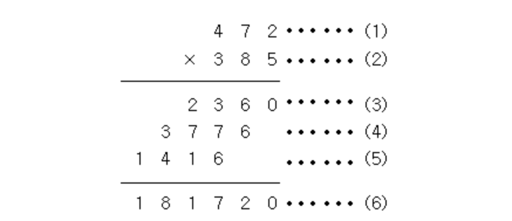

# 단계별_입출력과 사칙연산

----

----


# 2557. Hello World

#### Q. Hello World!를 출력하시오.

``` python
print("Hello World!")
```

파이썬을 조금이라도 배운 사람은 이 문제를 틀리지 않을 것이다..그런데 정말 충격적이게도 나는 첫 시도에 틀렸다. 어떻게 print(Hello World!)라고 당당히 적어놓고 제출하고 심지어 왜 틀렸는지도 모를수가있지.. 파이썬 복습이 정말 철저하게 필요한 사람이라는걸 또 깨달았다. 


-----


# 10718. We love kriii

##### ACM-ICPC 인터넷 예선, Regional, 그리고 World Finals까지 이미 2회씩 진출해버린 kriii는 미련을 버리지 못하고 왠지 모르게 올해에도 파주 World Finals 준비 캠프에 참여했다. 대회를 뜰 줄 모르는 지박령 kriii를 위해서 격려의 문구를 출력해주자.

#### Q. 두 줄에 걸쳐 "강한친구 대한육군"을 한 줄에 한 번씩 출력한다.

``` python
print("강한친구 대한육군")
print("강한친구 대한육군")
```

이번에는 한번에 맞혔다.. 그런데 대체 왜 print("", end="")을 써야 한다고 착각했는지 모르겠다. print는 자동 개행인데.. 프린트를 두번 사용하거나 프린트 문 내에서 \n을 통해 자동으로 개행시킬 수 있을 것 같다. 한번 더 시도해봐야겠다. 

``` python
print("강한친구 대한육군\n강한친구 대한육군")
```

맞았다!! 한가지 문제에서도 두가지 방법을 생각해낸것이 자랑스럽다.. 비록..정말 작은 기초부분이긴 하지만..ㅎㅎ 


----


# 10171. 고양이

#### 아래 예제와 같이 고양이를 출력하시오.

``` python
\    /\
 )  ( ')
(  /  )
 \(__)|
```

``` python
print("\\    /\\")
print(" )  ( ') ")
print("(  /  )")
print(" \\(__)|")
```

``` python
\    /\
 )  ( ') 
(  /  )
 \(__)|
```

똑같아 보이나...? 모르겠다. 고양이 얼굴이랑 몸이 조금 똥똥해져서 수정했는데 정답일지는..해보러가야겠다. 

맞았다!!!! 세번째 문제부터 py 파일을 만들어서 풀게될거라곤 생각못했는데 이렇게 맞으니 또 기분이 좋다!

백틱과 | 기호의 위치만 알면 풀 수 있는 문제였다. 부끄럽게도 | 기호를 못찾아 모각코에서 물어봤었는데.. `shift + \`였다. 기억하자!


----


# 10172. 개

#### 아래 예제와 같이 개를 출력하시오.

``` python
|\_/|
|q p|   /}
( 0 )"""\
|"^"`    |
||_/=\\__|
```

``` python
print("|\\_/|")
print("|q p|   /}")
print('( 0 )"""\\')
print('|"^"`    |')
print('||_/=\\\\__|')
```

``` python
|\_/|
|q p|   /}
( 0 )"""\
|"^"`    |
||_/=\\__|
```

뭔가 묘하게 내 강아지가 더 찌그러져있는 모양인 것 같아서 답이 아닐줄 알았는데 다행히 맞았다! 쭉쭉 진도가 나가서 행복하다.

----


# 1000. A+B

#### 두 정수 A와 B를 입력받은 다음, A+B를 출력하는 프로그램을 작성하시오.

첫째 줄에 A와 B가 주어진다. (0 < A, B < 10)

첫째 줄에 A+B를 출력한다.

``` python
1 2

#3
```

map 함수에 대한 이해가 아직 떨어지는 것 같다. input()으로 받은 값을 바로 int로 변환시키려면 map(int,input())을 활용하면 되는 줄 알았는데 계속 에러가 뜬다. 제대로 알아봐야 겠다. 사실 기초문제인데도 불구하고 해결법을 찾기가 어려웠던 것은 문자열의 메서드에 대한 이해가 부족하기 때문인 것 같다. .split을 이용해 각각 a b 에 할당하고 정수로 변환시켜 더한 값을 반환하기만 하면되는걸.. 갈길이 멀다는게 다시 느껴진다. 그러니 더 열심히해야지 :)

``` python
A, B = input().split()
print(int(A) + int(B))
```

정말 정말 기초적인 실수를 한번 더 했다. split 메서드 뒤에 ()를 안붙인거다.. 첫술에 배부를수는 없지만 그래도 배운지 얼마나됐다고 이정도로 까먹었는지 정말 속상하다. 


``` python
result = list(map(int, input().split()))
print(sum(result))
```

sum으로 구현해봤다. -와 *는 어떻게 구현할 수 있을지 고민해봐야겠다. 

---


# 1001. A-B

#### 두 정수 A와 B를 입력받은 다음, A-B를 출력하는 프로그램을 작성하시오.

첫째 줄에 A와 B가 주어진다. (0 < A, B < 10)

첫째 줄에 A+B를 출력한다.

``` python
3 2 
#1
```

``` python
A, B = input().split()
print(int(A) - int(B))
```

물론 이번에는 무난하게 성공했다.. ~~바로 위에 저걸 풀어놓고 또 틀리면 사람이아니다~~ . 꼭 A B 를 지정해야하는게 아니라면 map 함수를 활용해서 풀 수는 없을까? 합계라면 그냥 sum을 이용해서 풀 수 있는데, 빼기는 안되는 것 같다. 

----


# 10998. A*B

#### 두 정수 A와 B를 입력받은 다음, A*B를 출력하는 프로그램을 작성하시오.

첫째 줄에 A와 B가 주어진다. (0 < A, B < 10)

첫째 줄에 A*B를 출력한다.

``` python
1 2
#2

3 4
#12
```

``` python
A, B = int(input().split())
print(a*b)
```

``` python
A, B = input().split()
print(int(a)*int(b))
```

두번이나 런타임 에러를 냈다.. 왜 그런지 다시 보면 알까? 파이썬은 대소문자를 구분한다.. A, B와 a,b는 명백하게 다른것이다.. 그리고 인풋으로 받은 a, b값을 한번에 int로 변경하려면 error가 난다. 하나 하나 int()를 넣는게 힘들다면 map을 통해서 변형해줘야할 것 같다. 

---

 

# 1008. A/B

#### 두 정수 A와 B를 입력받은 다음, A/B를 출력하는 프로그램을 작성하시오.

첫째 줄에 A와 B가 주어진다. (0 < A, B < 10)

첫째 줄에 A*B를 출력한다.

``` python
1 3
#0.33333333333333333333333333333333

4 5
#0.8
```

``` python
a, b = input().split()
print(int(a) / int(b))
```

정말 혼란의 도가니다.. /는 나누기, //은 몫, %이 나머지라는 사실이 헷갈렸다. 이렇게라도 다시 상기시키며 장기기억에 들어갈 수 있도록 해야겠다. 

----


# 10869. 사칙연산

#### 두 자연수 A와 B가 주어진다. 이때, A+B, A-B, A*B, A/B(몫), A%B(나머지)를 출력하는 프로그램을 작성하시오.

두 자연수 A와 B가 주어진다. (1 ≤ A, B ≤ 10,000)

첫째 줄에 A+B, 둘째 줄에 A-B, 셋째 줄에 A*B, 넷째 줄에 A/B, 다섯째 줄에 A%B를 출력한다.

``` python
7 3

#10
#4
#21
#2
#1
```

``` python
a,b = input().split()

print(int(a)+int(b))
print(int(a)-int(b))
print(int(a)*int(b))
print(int(a)//int(b))
print(int(a)%int(b))
```

넷째 줄에 A/B를 출력하라길래 print(int(a)/int(b)) 를 했었는데 틀려서 황당.. 예시 값과 결과를 맞춰주니 다행히 맞았다. 


----


# 10926. ??!

#### 준하는 사이트에 회원가입을 하다가 joonas라는 아이디가 이미 존재하는 것을 보고 놀랐다. 준하는 놀람을 ??!로 표현한다. 준하가 가입하려고 하는 사이트에 이미 존재하는 아이디가 주어졌을 때, 놀람을 표현하는 프로그램을 작성하시오.

``` python
joonas
#joonas??!
```

문제를 똑바로 읽는 습관을 들여야겠다. 준하가 joonas라는 글자를 발견할 때만 놀라는줄 알고 

``` python
a = input()
if a == "joonas":
    print("joonas??!")
```

이렇게 코드를 짰다가 틀렸다. 

``` python
a = input()
print(a + "??!")
```

정답코드는 이 코드였는데, 문제를 풀며 늘 가지던 궁금증을 조금 해소할 수 있었다. 

``` python
a = input()
print(input() + "??!")
```

으로 하면안되는가? 였는데 그 궁금증이 풀렸다. 내가 input을 두번 작성하면 두번의 input값을 적어야 하는 것이었다. 

``` python
print(input() + "??!")
```

그렇다면 이 한줄짜리 코드는? 채점해봐야겠다

맞았다! 두줄이던 코드를 한줄로 줄여서 기분이 좋다 :)

----


# 18108. 1998년생인 내가 태국에서는 2541년생?!

#### ICPC Bangkok Regional에 참가하기 위해 수완나품 국제공항에 막 도착한 팀 레드시프트 일행은 눈을 믿을 수 없었다. 공항의 대형 스크린에 올해가 2562년이라고 적혀 있던 것이었다.

#### 불교 국가인 태국은 불멸기원(佛滅紀元), 즉 석가모니가 열반한 해를 기준으로 연도를 세는 불기를 사용한다. 반면, 우리나라는 서기 연도를 사용하고 있다. 불기 연도가 주어질 때 이를 서기 연도로 바꿔 주는 프로그램을 작성하시오.

서기 연도를 알아보고 싶은 불기 연도 *y*가 주어진다. (1000 ≤ *y* ≤ 3000)

불기 연도를 서기 연도로 변환한 결과를 출력한다.

``` python
2541

#1998
```

``` python
print(int(input())-543)
```

내가 점점 백준에 익숙해져 가고 있는 것인지 문제를 파악하는 속도도, 오류 횟수도 줄어든다. 그리고 이번에도 한줄 코딩이 나왔다 ㅎㅎ

----


# 10430. 나머지 

#### (A+B)%C는 ((A%C) + (B%C))%C 와 같을까?

#### (A×B)%C는 ((A%C) × (B%C))%C 와 같을까?

#### 세 수 A, B, C가 주어졌을 때, 위의 네 가지 값을 구하는 프로그램을 작성하시오.

첫째 줄에 A, B, C가 순서대로 주어진다. (2 ≤ A, B, C ≤ 10000)

첫째 줄에 (A+B)%C, 둘째 줄에 ((A%C) + (B%C))%C, 셋째 줄에 (A×B)%C, 넷째 줄에 ((A%C) × (B%C))%C를 출력한다.

``` python
5 8 4

#1
#1
#0
#0
```

``` python
A, B, C = map(int, input().split())
print((A + B) % C)
print(((A % C) + (B % C)) % C)
print((A * B) % C)
print(((A % C) * (B % C)) % C)
```

드디어 map을 활용하는 방법을 기억해냈다!! 찾아보지않고 스스로 떠올려내서 더 갚지다. 출력하라고 하는 값이 길어질 수록 int를 반복하기가 까다로웠는데, map을 통해서 input값을 int로 변환시켜준 다음에 자유자재로 활용할 수 있었다. 한번만에 맞혀서 너무 기쁘다!

---


# 2588. 곱셈

#### (세 자리 수) × (세 자리 수)는 다음과 같은 과정을 통하여 이루어진다.



#### (1)과 (2)위치에 들어갈 세 자리 자연수가 주어질 때 (3), (4), (5), (6)위치에 들어갈 값을 구하는 프로그램을 작성하시오.

첫째 줄에 (1)의 위치에 들어갈 세 자리 자연수가, 둘째 줄에 (2)의 위치에 들어갈 세자리 자연수가 주어진다.

첫째 줄부터 넷째 줄까지 차례대로 (3), (4), (5), (6)에 들어갈 값을 출력한다.

``` python
472
385

#2360
#3776
#1416
#181720
```

``` python
a = input()
b = input()
c = int(a) * int(b[-1])
d = int(a) * int(b[-2])
e = int(a) * int(b[0])

print(c)
print(d)
print(e)
print(c + 10 * d + 100 * e)
```

한번만에 맞았다!!! 

문제를 접근하는데 있어 잠시 고민했지만 한번 접근법을 생각하고 나니 쉬웠다. 또 아까 내가 의문을 가졌던 input 덕분에 이번에는 가로로 나란히 값이 주어지는게 아닌, 세로로 값이 주어지는 input도 당황하지 않고 해낼 수 있었다. 

input값 분리하기 : input().split()

input값 두개 받기 : input() input()